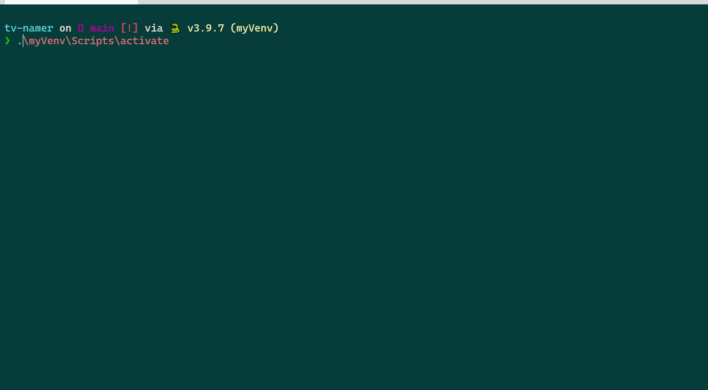
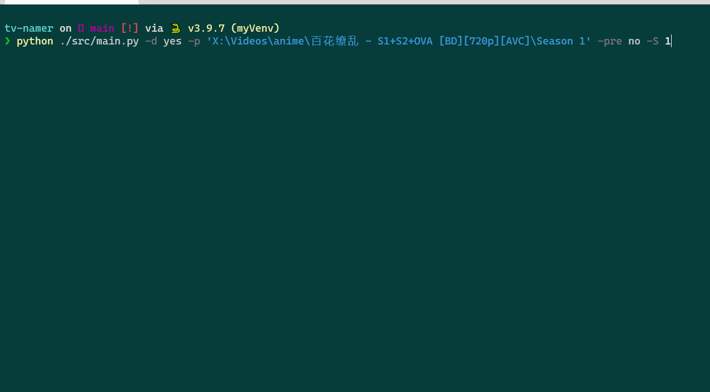

# tv-renamer


## Usage

```
python -m venv myVenv
.\myVenv\Scripts\activate # PowerShell active command
python ./src/main.py -d yes -p 'X:\Videos\anime\清恋[VCB-Studio] Seiren [Ma10p_1080p]' -pre yes -S 1
```
字幕文件批量重命名推荐SubRenamer

## Example

自动匹配集号的前缀


手动输入集号的前缀

## motivation

一开始玩jellyfin，用tinymediamanager刮削。发现会有如下的问题。


其实github有些类似的 https://github.com/dbr/tvnamer。但还是不和我胃口

## To do
- [x] 文件夹下的识别出Episodes的编号，并重命名
- [ ] 支持查找theTVDB来重命名SP
- [ ] 不是脚本，变成python的可执行文件
